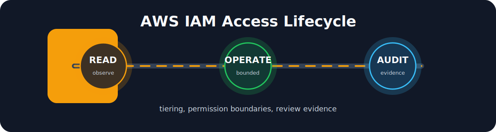

# AWS IAM Security

[](#)
[](#)
[](#)
[](#)

This project models AWS IAM security through access lifecycle management, tiering and the principle of least privilege. It is intentionally small enough to read in one sitting and concrete enough to discuss in a technical interview.

## What this project demonstrates

- Role tiering for read-only, operator and security-auditor access.
- A permissions boundary that limits delegated administration.
- JSON policies designed for review with IAM Access Analyzer.
- A small local linter that flags risky wildcard patterns.
- A lifecycle runbook that connects IAM operations to security governance.

## Access model

```text
Identity provider / SSO
        |
        v
+-------------------+      +----------------------+      +----------------+
| ReadOnly tier     | ---> | Operator tier        | ---> | Emergency tier |
| Observe only      |      | Scoped operations    |      | Time boxed     |
+-------------------+      +----------------------+      +----------------+
        |                            |
        v                            v
Review evidence              Permission boundary
```

## Repository map

```text
.
|-- docs/
|   |-- access-lifecycle.md
|   `-- control-mapping.md
|-- policies/
|   |-- boundary-delegated-admin.json
|   |-- tier-operator.json
|   |-- tier-readonly.json
|   `-- tier-security-auditor.json
|-- scripts/
|   `-- Test-IamPolicies.ps1
`-- terraform/
    |-- main.tf
    |-- outputs.tf
    `-- variables.tf
```

## Local policy review

```powershell
Set-ExecutionPolicy -Scope Process -ExecutionPolicy Bypass -Force
./scripts/Test-IamPolicies.ps1 -PolicyPath ./policies
```

The script is not a replacement for IAM Access Analyzer. It catches obvious mistakes before policies reach AWS: broad actions, broad resources and missing conditions around sensitive services.

## Interview talking points

- Why a permissions boundary does not grant access by itself.
- How identity-based policies and boundaries intersect.
- Why human access should use federation and temporary credentials.
- How tiering supports lifecycle management and least privilege.

## References

- AWS IAM best practices: https://docs.aws.amazon.com/IAM/latest/UserGuide/best-practices.html
- IAM policy evaluation logic: https://docs.aws.amazon.com/IAM/latest/UserGuide/reference_policies_evaluation-logic.html
- Permissions boundaries: https://docs.aws.amazon.com/IAM/latest/UserGuide/access_policies_boundaries.html
- IAM Access Analyzer policy validation: https://docs.aws.amazon.com/IAM/latest/UserGuide/access-analyzer-policy-validation.html
